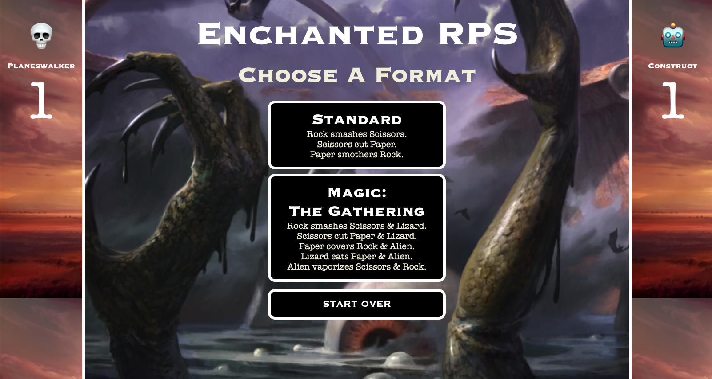
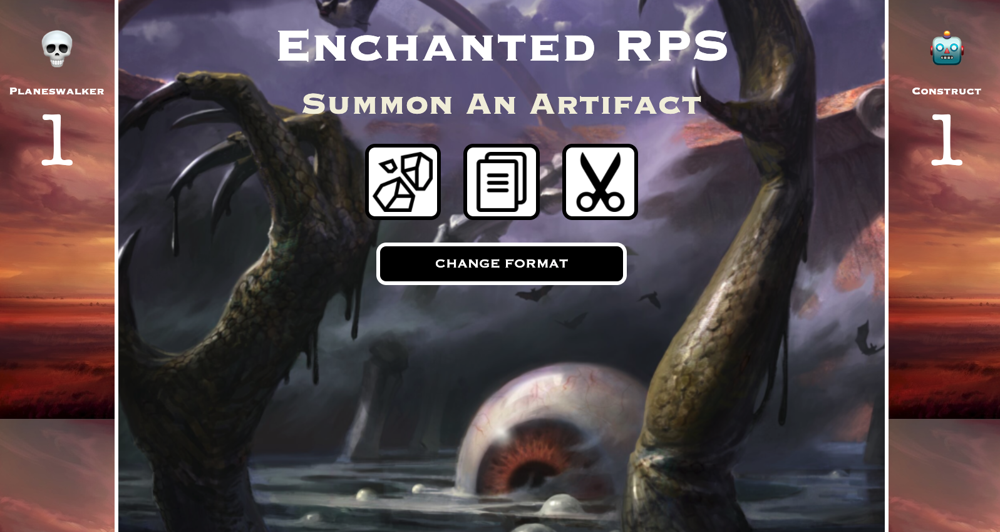
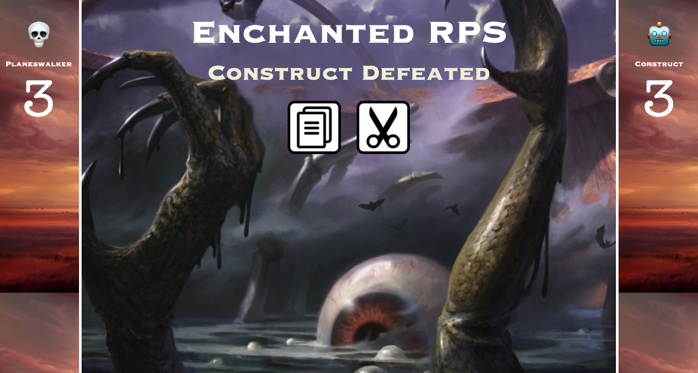
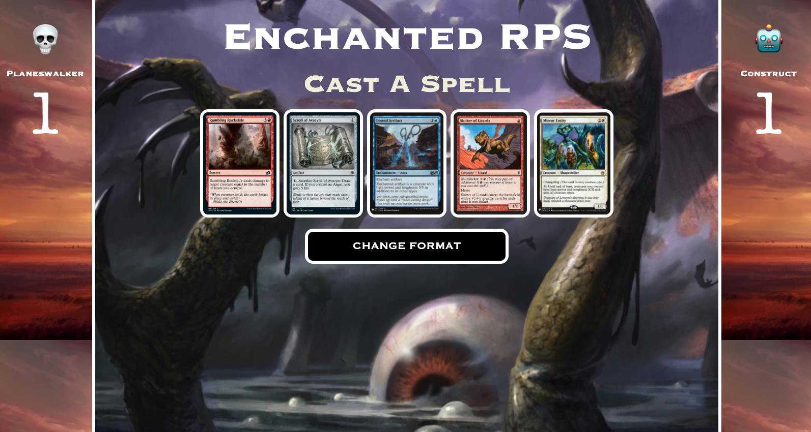
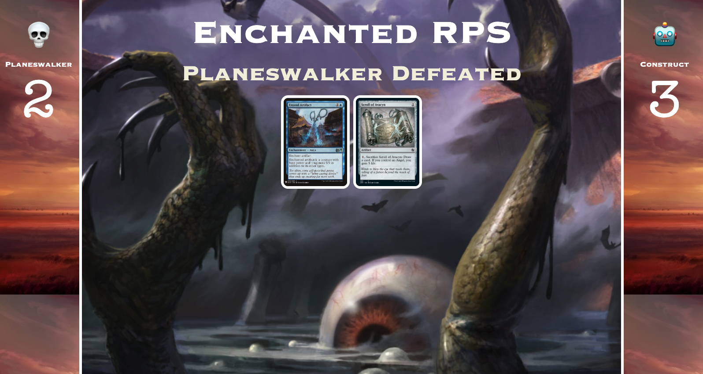

# Rock Paper Scissors

This is an application that allows a user to play Rock Paper Scissors against a computer. The user selects format, either Standard RPS, with 3 choices, or Magic: The Gathering RPS, with 5 choices. The app keeps track of all time score between the user, known as a "planewalker", and the computer, know as a "construct".

## Motivation and rubric

This project was completed as a final project at Turing School of Software & Design in order to pass Module 1.

https://frontend.turing.edu/projects/module-1/rock-paper-scissors-solo.html

### Changed features

* The "Change Format" button felt more intuitively located in the middle of the page with the other buttons, instead of inside the left score column.

* The "Change Format" button is hidden when the human and computer selections are shown. Then, it displays again when the user is choosing their artifact or spell.

### Extra feature

* The user now has a "Start Over" button, which is explained below in more detail.

## Reflections

A great challenge for this project was learning how to get the DOM and the data model to work smoothly together. However, once it happened, seeing the site functioning was a big win.

Getting the CSS to match both the rubric and personal design goals was also a learning experience, but the project made for a great creative outlet.

## Languages

Written in JavaScript, CSS, and HTML

## Technology used

Built with Visual Studio Code & Atom

Code stored on GitHub

Running on GitHub Pages

## How to use?

The site is live at https://hayleyw7.github.io/rock-paper-scissors/.

The user starts on the home page with a score of 0 for both the "Planeswalker" (the user) and the "Construct" (the computer).

The user can select a game to play, either "Standard", which is the common version of Rock-Paper-Scissors (RPS), or "Magic: The Gathering", which is a Magic: The Gathering themed (MTG) version of an RPS variant called Rock-Paper-Scissors-Lizard-Spock.

If the user selects "Standard", they are presented with 3 images: rock, paper, and scissors. When they click one, the computer also randomly selects one, and those two selections will display on the screen. The winner gains one point, and the original rock, paper, and scissors images will display again. From there, user can play another time by clicking an image, or they can click "Change Format" to go back to the home page.

If the user selects "Magic: The Gathering" from the home page, they are presented with 5 images: rock, paper, scissors, lizard, and alien. When they click a MTG card, the results and display will work just like in the previous game, except that it referenced five MTG choices instead of three RPS choices.

If at any point a user wants to clear the score to 0-0, they can click "Start Over" on the home page.

## Screenshots

## Future additions

* The user will have an option to play against another human user.

* The user will be able to enter their own name and emoji token.

## Contributor

Project completed by [Hayley Witherell](https://github.com/hayleyw7)